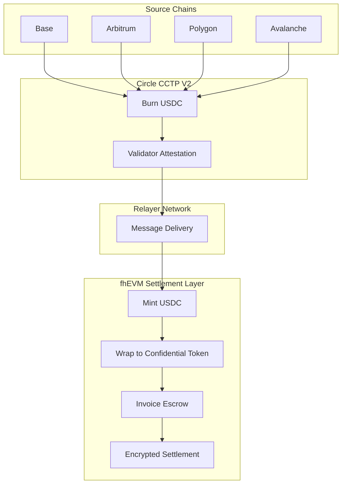

# Privara: Cross-Chain Confidential Invoice Settlement

**Extending Zama fhEVM to Cross-Chain Commerce**

---

## Abstract

Privara is a confidential invoice settlement protocol that enables privacy-preserving commercial payments on public blockchains. Using Fully Homomorphic Encryption (FHE), invoice amounts and recipient addresses remain encrypted throughout the entire payment lifecycle. By integrating Circle CCTP V2, Privara extends fhEVM capabilities beyond single-chain applications — enabling confidential transactions to originate from any CCTP-supported chain while settling privately on FHE-enabled networks.

---

## Problem

Commercial transactions on public blockchains expose sensitive business information. When a business issues an invoice and receives payment on-chain, the following data becomes permanently visible:

- **Transaction amounts** reveal pricing strategies, contract values, and profit margins
- **Payment patterns** expose customer relationships, payment terms, and business volumes
- **Address linkage** connects on-chain activity to real-world business identities
- **Timing analysis** enables front-running and competitive intelligence

Current privacy solutions present significant tradeoffs:

| Solution | Tradeoff |
|----------|----------|
| Private networks | Sacrifice composability with public DeFi |
| Zero-knowledge proofs | Require circuit redesign for each operation |
| Trusted execution environments | Depend on hardware security assumptions |
| Mixing protocols | Insufficient for commercial compliance requirements |

Businesses require a solution that preserves transaction privacy while maintaining composability, auditability, and regulatory compliance.

---

## Solution

Privara introduces confidential invoice settlement using three core innovations:

### 1. FHE-Based Invoice Escrow

Invoice data is stored as encrypted values using Zama's TFHE scheme. All operations — payment verification, ownership checks, redemption logic — execute on encrypted values without decryption.

### 2. Cross-Chain Payment Origination

Using Circle CCTP V2, payments can originate from any supported chain. USDC is burned on the source chain, attested by Circle validators, and minted on fhEVM where it's wrapped to a confidential representation.

### 3. Decentralized Relayer Network

A network of independent operators ensures reliable cross-chain message delivery without introducing trusted intermediaries or centralization points.

---

## Why FHE

Fully Homomorphic Encryption enables computation on encrypted data without decryption. Privara leverages this for invoice operations:

### vs. Zero-Knowledge Proofs

ZK systems require predefined circuits for each computation. Adding new invoice logic (partial payments, multi-party settlements, conditional releases) requires circuit redesign and trusted setup ceremonies. FHE enables flexible computation — new operations can be composed from existing encrypted primitives without system-wide changes.

### vs. Trusted Execution Environments

TEE solutions (SGX, TrustZone) rely on hardware manufacturers' security guarantees. Side-channel attacks, firmware vulnerabilities, and supply chain risks introduce trust assumptions beyond cryptography. FHE security depends solely on mathematical hardness assumptions (LWE problem), providing cryptographic rather than hardware-based guarantees.

### vs. Partial Homomorphic Encryption

Schemes supporting only addition or multiplication cannot handle invoice settlement requirements. Payment verification requires comparisons, redemption requires conditional logic, and ownership verification requires equality checks. TFHE supports all these operations through programmable bootstrapping, enabling unlimited sequential operations without noise accumulation.

---

## Cross-Chain Architecture

Privara positions fhEVM as a privacy settlement layer for the broader EVM ecosystem:

### What Makes This Different

**Traditional Payment**: Amount visible → Recipient visible → Transaction graph analyzable

**Privara Payment**: Amount encrypted → Recipient encrypted → Settlement verified homomorphically

---

## Technology Stack

### Zama fhEVM

- **TFHE Scheme**: Torus Fully Homomorphic Encryption with programmable bootstrapping
- **Encrypted Primitives**: Native support for encrypted integers, addresses, and booleans
- **Homomorphic Operations**: Arithmetic, comparison, and conditional operations on ciphertexts

### ERC-7984 Confidential Tokens

- Standardized interface for encrypted token balances
- Wrapping mechanism: public USDC to confidential representation
- Encrypted transfers between addresses

### Circle CCTP V2

- Trust-minimized USDC bridging via burn-and-mint
- Validator-attested message passing
- Sub-minute finality on supported chains

---

## Product

Privara delivers confidential invoicing through consumer applications:

### Web Application

Browser-based interface for businesses to create, manage, and settle confidential invoices.

### iOS Application

Native mobile experience with secure key management, biometric authentication, and push notifications.

### Target Users

- **Enterprises** with confidential contract values and supplier relationships
- **Freelancers** protecting rate information from clients and competitors
- **B2B payments** requiring privacy for commercial terms and volumes

---

## Roadmap

| Milestone | Target |
|-----------|--------|
| Public Testnet | January 16, 2026 |
| Security Audits | Q1 2026 |
| Mainnet Launch | Q2 2026 (tentative) |

---

## Conclusion

Privara demonstrates that fhEVM is not limited to single-chain applications. By integrating Circle CCTP V2, we enable confidential settlement from any CCTP-supported chain — positioning Zama's FHE technology as cross-chain privacy infrastructure for commercial blockchain payments.

The protocol addresses a real market need: businesses require transaction privacy to operate commercially on public blockchains. FHE provides the cryptographic foundation for confidential computation, CCTP provides the cross-chain connectivity, and Privara combines them into a practical product for enterprise invoice settlement.

---

**Extending fhEVM to cross-chain commerce**
