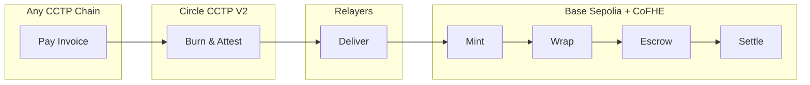

# Protocol Architecture

**Confidential Invoice Settlement on Base Sepolia via Fhenix CoFHE**

---

## Overview

Privara is a confidential invoice settlement protocol that combines:

- **FHE-based escrow** for encrypted invoice storage and settlement on Base Sepolia via Fhenix CoFHE
- **Cross-chain payments** via Circle CCTP V2 for multi-chain payment origination
- **Decentralized relay** for trustless message delivery between chains

The protocol enables invoice amounts and owner addresses to remain encrypted throughout the entire lifecycle — from creation through payment verification to redemption.

---

## Privacy Comparison

| | Public Blockchain | Privara Protocol |
|---|---|---|
| **Transfer Type** | Standard USDC | Confidential USDC |
| **Amount** | $10,000 (visible) | Encrypted |
| **Recipient** | 0x1234...abcd (visible) | Encrypted |
| **Transaction Graph** | Fully analyzable | Protected |

---

## Cross-Chain Flow

Payment originates on Ethereum Sepolia → USDC burned and attested → Relayer delivers to Base Sepolia → Minted and wrapped to confidential token via CoFHE → Invoice escrow updated with encrypted amount → Settlement verified homomorphically.

---

## Core Components

| Component | Purpose |
|-----------|---------|
| **Confidential Token** | ERC-7984 wrapper for encrypted USDC balances |
| **Invoice Escrow** | Encrypted invoice storage and FHE-based settlement |
| **CCTP Receiver** | Cross-chain attestation validation and token minting |
| **Relayer Network** | Decentralized message delivery infrastructure |

---

## Privacy Guarantees

### What Remains Encrypted

| Data | On Public Chains | On Privara |
|------|------------------|------------|
| Invoice Amount | Visible to all | Encrypted (`euint64`) |
| Invoice Owner | Visible to all | Encrypted (`eaddress`) |
| Payment Status | Visible to all | Encrypted (`ebool`) |
| Transaction History | Fully analyzable | Protected |

### How Settlement Works

1. **Invoice Created** — Amount and owner stored as encrypted values
2. **Payment Received** — Added to invoice balance via homomorphic addition
3. **Redemption Requested** — Ownership and completion verified on encrypted data
4. **Funds Released** — Transfer executed based on encrypted condition evaluation

No plaintext values are exposed at any point in the settlement flow.

---

## FHE Capabilities

Privara leverages Fhenix CoFHE's FHE implementation:

| Capability | Use Case |
|------------|----------|
| Encrypted integers | Invoice amounts and payment values |
| Encrypted addresses | Invoice ownership |
| Encrypted booleans | Status flags and conditions |
| Homomorphic arithmetic | Balance accumulation |
| Encrypted comparisons | Payment verification |
| Conditional operations | Privacy-preserving redemption |

---

## Security Model

### Cryptographic Foundation

- **FHE Security**: Based on Learning With Errors (LWE) hardness assumption
- **No Hardware Trust**: Pure cryptographic guarantees, no TEE dependency
- **Proof Verification**: ZK proofs validate encrypted input well-formedness

### Cross-Chain Security

- **Circle Attestations**: Validator threshold signatures for message authenticity
- **Replay Protection**: Nonce-based message uniqueness
- **Defense in Depth**: Multiple validation layers

### Trust Assumptions

| Component | Assumption |
|-----------|------------|
| Fhenix CoFHE | Correct FHE computation and key management |
| Circle Validators | Honest attestation of cross-chain messages |
| Base Sepolia Network | Consensus integrity |

---

## Relayer Network

Decentralized operators ensure reliable cross-chain message delivery:

- **Permissionless**: Any operator can participate
- **Incentivized**: Fees for successful deliveries
- **Redundant**: Multiple operators ensure liveness

---

## Deployment

**Contract addresses available January 20, 2026**

### Testnet Networks

| Network | Role |
|---------|------|
| Base Sepolia | CoFHE destination (core chain) |
| Ethereum Sepolia | CCTP source chain |
| Additional chains | Post-launch expansion |

---

## What's Next

- **Additional source chains** — Expand CCTP-supported origins
- **Multi-asset support** — Beyond USDC settlement
- **Programmable invoices** — Conditional release logic
- **Batch operations** — Gas optimization
- **AI agentic attestation** — Automated verification workflows

---

**Extending CoFHE to cross-chain commerce**
